# Rolling Scopes School
## Performance

# 📊 Производительность приложения (React DevTools Profiler)

### 🔍 Тестируемая операция:
* ***Filter countries by region (All -> Antarctic)***

### 📌 Результаты профилирования:
- **Commit Duration:** 1.8s
- **Максимальное время рендеринга компонента:** 24.1ms (Компонент `<HomePage>`)
- **Наиболее затратный компонент:** 23.4ms `<ListItems>`
- **Количество повторных рендеров:** 3

### 📊 Графики профилирования:
#### 1️⃣ **Flame Graph**


#### 2️⃣ **Ranked Chart**


### 🔍 Тестируемая операция:
* ***Filter countries by region(Antarctic -> Americas)***

### 📌 Результаты профилирования:
- **Commit Duration:** 2.7s
- **Максимальное время рендеринга компонента:** 25.3ms (Компонент `<HomePage>`)
- **Наиболее затратный компонент:** 24.6ms `<ListItems>`
- **Количество повторных рендеров:** 3 

### 📊 Графики профилирования:
#### 1️⃣ **Flame Graph**


#### 2️⃣ **Ranked Chart**


### 🔍 Тестируемая операция:
* ***Filter countries by region(Americas -> Europe)***

### 📌 Результаты профилирования:
- **Commit Duration:** ~2.2s
- **Максимальное время рендеринга компонента:** 17.8ms (Компонент `<HomePage>`)
- **Наиболее затратный компонент:** 16.7ms `<ListItems>`
- **Количество повторных рендеров:** 3 

### 📊 Графики профилирования:
#### 1️⃣ **Flame Graph**


#### 2️⃣ **Ranked Chart**

### 🔍 Тестируемая операция:
* ***Filter countries by region(Europe -> Africa)***

### 📌 Результаты профилирования:
- **Commit Duration:** ~2.8s
- **Максимальное время рендеринга компонента:** 22.6ms (Компонент `<HomePage>`)
- **Наиболее затратный компонент:** 22ms `<ListItems>`
- **Количество повторных рендеров:** 3 

### 📊 Графики профилирования:
#### 1️⃣ **Flame Graph**


#### 2️⃣ **Ranked Chart**

### 🔍 Тестируемая операция:
* ***Filter countries by region(Africa -> Asia)***

### 📌 Результаты профилирования:
- **Commit Duration:** ~2.2s
- **Максимальное время рендеринга компонента:** 16.4ms (Компонент `<HomePage>`)
- **Наиболее затратный компонент:** 15.7ms `<ListItems>`
- **Количество повторных рендеров:** 3 

### 📊 Графики профилирования:
#### 1️⃣ **Flame Graph**


#### 2️⃣ **Ranked Chart**


### 🔍 Тестируемая операция:
* ***Filter countries by region(Asia -> Oceania)***

### 📌 Результаты профилирования:
- **Commit Duration:** ~2.2s
- **Максимальное время рендеринга компонента:** 8.8ms (Компонент `<HomePage>`)
- **Наиболее затратный компонент:** 8.2 ms`<ListItems>`
- **Количество повторных рендеров:** 3

### 📊 Графики профилирования:
#### 1️⃣ **Flame Graph**


#### 2️⃣ **Ranked Chart**


### 🔍 Тестируемая операция:
* ***Filter countries by region(Oceania -> All)***

### 📌 Результаты профилирования:
- **Commit Duration:** ~3.2s
- **Максимальное время рендеринга компонента:** 86.8ms (Компонент `<HomePage>`)
- **Наиболее затратный компонент:** 85.9ms `<ListItems>`
- **Количество повторных рендеров:** 3 

### 📊 Графики профилирования:
#### 1️⃣ **Flame Graph**


#### 2️⃣ **Ranked Chart**

---

### 🔍 Тестируемая операция:
* ***Sort countries by population(population DESC -> population ASC)***

### 📌 Результаты профилирования:
- **Commit Duration:** ~1.9s
- **Максимальное время рендеринга компонента:** 28ms (Компонент `<HomePage>`)
- **Наиболее затратный компонент:** 27ms `<ListItems>`
- **Количество повторных рендеров:** 3

### 📊 Графики профилирования:
#### 1️⃣ **Flame Graph**


#### 2️⃣ **Ranked Chart**


### 🔍 Тестируемая операция:
* ***Sort countries by name(population ASC -> name ASC)***

### 📌 Результаты профилирования:
- **Commit Duration:** ~3s
- **Максимальное время рендеринга компонента:** 34.9ms (Компонент `<HomePage>`)
- **Наиболее затратный компонент:** 34.1ms `<ListItems>`
- **Количество повторных рендеров:** 3

### 📊 Графики профилирования:
#### 1️⃣ **Flame Graph**


#### 2️⃣ **Ranked Chart**


### 🔍 Тестируемая операция:
* ***Search Belarus***

### 📌 Результаты профилирования:
- **Commit Duration:** ~2s
- **Максимальное время рендеринга компонента:** 30.6ms (Компонент `<HomePage>`)
- **Наиболее затратный компонент:** 28.7 ms `<ListItems>`
- **Количество повторных рендеров:** 14

### 📊 Графики профилирования:
#### 1️⃣ **Flame Graph**


#### 2️⃣ **Ranked Chart**


### 🔍 Тестируемая операция:
* ***Toggle visited for US and India***

### 📌 Результаты профилирования:
- **Commit Duration:** ~1.2s
- **Максимальное время рендеринга компонента:** 30.1ms (Компонент `<HomePage>`)
- **Наиболее затратный компонент:** 28.8 ms `<ListItems>`
- **Количество повторных рендеров:** 4

### 📊 Графики профилирования:
#### 1️⃣ **Flame Graph**


#### 2️⃣ **Ranked Chart**

---


### 🛠 Оптимизация:
## Optimizations Implemented

The following optimizations were implemented to achieve these goals:

### 1. `React.memo` for Component Memoization

`React.memo` is a higher-order component that memoizes a functional component. It prevents re-renders if the component's props haven't changed.

*   **`CountryItem.tsx`:** Wrapped with `React.memo` and a custom comparison function:
    ```typescriptreact
    export default React.memo(
      CountryItem,
      (prevProps, nextProps) => prevProps.isVisited === nextProps.isVisited
    );
    ```
    This prevents re-renders of individual country cards unless the `isVisited` prop changes.
*   **`ListItems.tsx`:** Wrapped with `React.memo` to prevent re-renders when the list of countries hasn't changed.
    ```typescriptreact
    export default React.memo(ListItems);
    ```
*   **`Categories.tsx`:** Wrapped with `React.memo` to prevent re-renders when the filter hasn't changed.
    ```typescriptreact
    const Categories = memo(function Categories({ value }: { value: FilterItem }) {
    // ...
    });
    export default Categories
    ```
*   **`Sort.tsx`:** Wrapped with `React.memo` to prevent re-renders when the sort hasn't changed.
    ```typescriptreact
    const Sort: React.FC<SortProps> = React.memo(function Sort({ value }) {
    // ...
    });
    export default Sort;
    ```

### 2. `useMemo` for Memoizing Derived Data

`useMemo` is a React hook that memoizes the result of a function. It only re-runs the function if its dependencies change.

*   **`HomePage.tsx`:** Used to memoize the `sortedAndFilteredCountries` list:
    ```typescriptreact
    const sortedAndFilteredCountries = useMemo(
      () =>
        sortAndFilterCountriesCallback(
          data || [],
          sortBy,
          order,
          filter,
          searchValue
        ),
      [data, sortBy, order, filter, searchValue, sortAndFilterCountriesCallback]
    );
    ```
    This ensures that the list of countries is only re-filtered and re-sorted when the `data`, `sortBy`, `order`, `filter`, or `searchValue` dependencies change.

### 3. `useCallback` for Memoizing Event Handlers

`useCallback` is a React hook that memoizes a function. It returns the same function instance between renders unless its dependencies change.

*   **`HomePage.tsx`:** Used to memoize the `toggleVisited` function:
    ```typescriptreact
    const toggleVisited = useCallback(
      (item: Name) => {
        dispatch(
          setVisited(
            isVisited(item.common)
              ? visited.visited.filter(
                  (country) => country.common !== item.common
                )
              : [...visited.visited, item]
          )
        );
      },
      [dispatch, visited]
    );
    ```
    This prevents child components from re-rendering when this function is passed as a prop, unless `dispatch` or `visited` changes.
* **`HomePage.tsx`**: Used to memoize the `sortAndFilterCountriesCallback` function:
    ```typescriptreact
    const sortAndFilterCountriesCallback = useCallback(
        (
          data: Country[] | [],
          sortBy: string,
          order: 'asc' | 'desc',
          filter: FilterPropertyEnum,
          searchValue: string
        ) => {
          return sortAndFilterCountries(data, sortBy, order, filter, searchValue);
        },
        []
      );
    ```
* **`Search.tsx`**: Used to memoize the `updateSearchValue` function:
    ```typescriptreact
    const updateSearchValue = useCallback((str: string) => {
        dispatch(setSearchValue(str));
      }, []);
    ```
* **`Categories.tsx`**: Used to memoize the `onClickFilterListItem` function:
    ```typescriptreact
    const onClickFilterListItem = useCallback(
        (obj: FilterItem) => {
          dispatch(setFilter(obj));
          setOpenFilter(false);
        },
        [dispatch]
      );
    ```
* **`Sort.tsx`**: Used to memoize the `onClickListItem` function:
    ```typescriptreact
    const onClickListItem = useCallback(
        (obj: SortType) => {
          dispatch(setSort(obj));
          setOpen(false);
        },
        [dispatch]
      );
    ```
### 4. Other Optimizations

*   **`key` Props:** Correctly used `key` props for lists (`ListItems.tsx`, `Categories.tsx`, `Sort.tsx`) to help React identify which items have changed, been added, or been removed.
*   **`active` class**: Added `active` class to highlight the active filter and sort options.
* **Using `event.target`**: Used `event.target` instead of `event.composedPath().includes(filterRef.current)` in `Categories.tsx` to close the dropdown when the user clicks outside of it.
* **Remove `console`**: Removed `console` in `CountryItem.tsx`.
* **Using `JSON.stringify` and `JSON.parse`**: Used `JSON.stringify` and `JSON.parse` to store and retrieve the data from local storage.


🔹 **Результат:**

### 🔍 Тестируемая операция:
* ***Filter countries by region (All -> Antarctic)***

### 📌 Результаты профилирования:
- **Commit Duration:** ~~1.8s~~ 2.2s (ухудшение на 22%)
- **Максимальное время рендеринга компонента:** ~~24.1ms~~ 1.1ms (улучшение на 95%) (Компонент `<HomePage>`) 
- **Наиболее затратный компонент:** ~~23.4ms~~ 0.2ms (улучшение на 99%) `<ListItems> (Memo)`
- **Количество повторных рендеров:** 2 (улучшение на 33%)

### 📊 Графики профилирования:
#### 1️⃣ **Flame Graph**
![Flame Graph]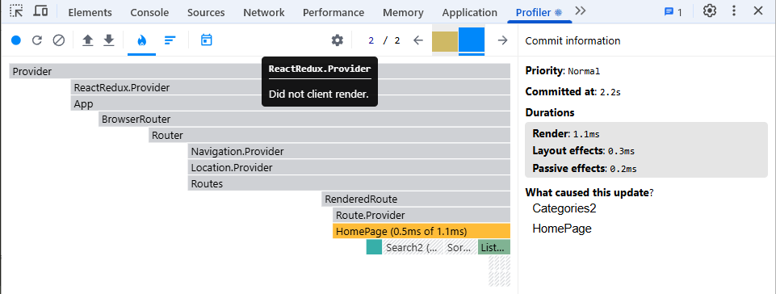

#### 2️⃣ **Ranked Chart**
![Ranked Chart]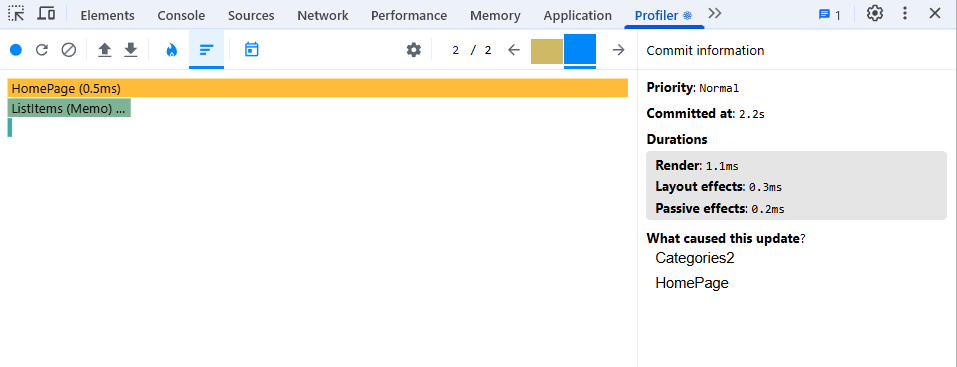

### 🔍 Тестируемая операция:
* ***Filter countries by region(Antarctic -> Americas)***

### 📌 Результаты профилирования:
- **Commit Duration:** ~~2.7s~~ 2.1s (ухудшение на 22%)
- **Максимальное время рендеринга компонента:** ~~25.3ms~~ 15.4ms (улучшение на 39%) (Компонент `<HomePage>`)
- **Наиболее затратный компонент:** ~~24.6ms~~ 14.4ms (улучшение на 41%) `<ListItems> (Memo)`
- **Количество повторных рендеров:** ~~3~~ 2 (улучшение на 30%)

### 📊 Графики профилирования:
#### 1️⃣ **Flame Graph**
![Flame Graph]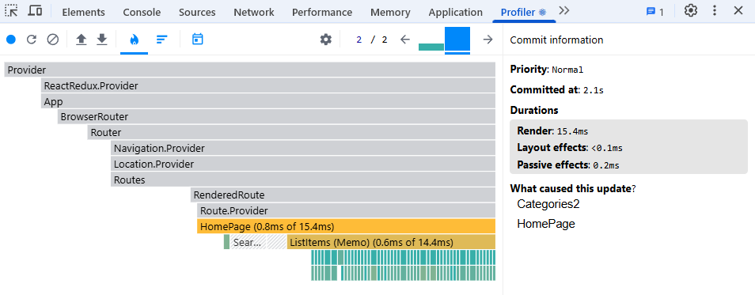

#### 2️⃣ **Ranked Chart**
![Ranked Chart]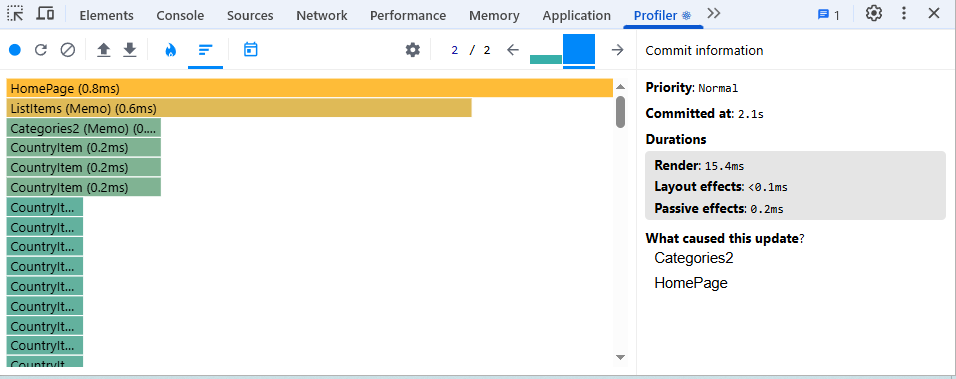

### 🔍 Тестируемая операция:
* ***Filter countries by region(Americas -> Europe)***

### 📌 Результаты профилирования:
- **Commit Duration:** ~~2.2s~~ 2.1ms (улучшение на 5%)
- **Максимальное время рендеринга компонента:** ~~17.8ms~~ 13.6ms (улучшение на 24%)(Компонент `<HomePage>`)
- **Наиболее затратный компонент:** ~~16.7ms~~ 13ms (улучшение на 22%) `<ListItems> (Memo)`
- **Количество повторных рендеров:** ~~3~~ 2 (улучшение на 30%)

### 📊 Графики профилирования:
#### 1️⃣ **Flame Graph**
![Flame Graph]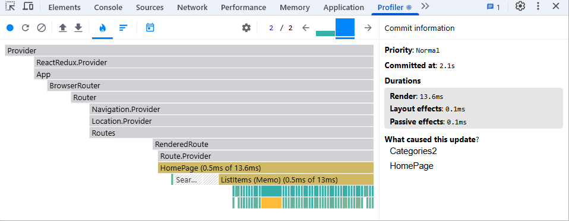

#### 2️⃣ **Ranked Chart**
![Ranked Chart]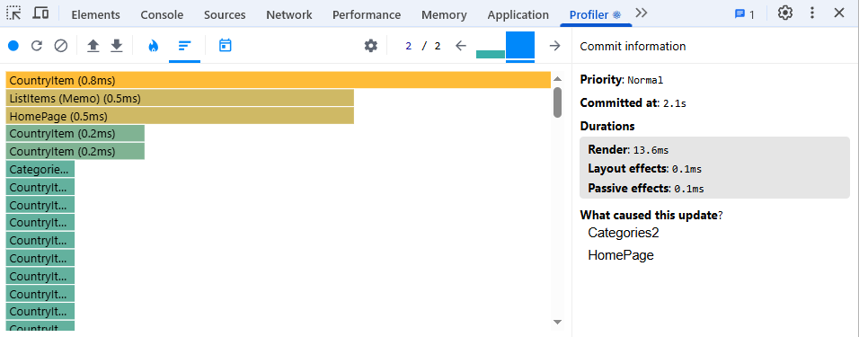

### 🔍 Тестируемая операция:
* ***Filter countries by region(Europe -> Africa)***

### 📌 Результаты профилирования:
- **Commit Duration:** ~~2.8s~~ 2.6s (улучшение на 7%)
- **Максимальное время рендеринга компонента:** ~~22.6ms~~ 15.1ms (улучшение на 33%) (Компонент `<HomePage>`)
- **Наиболее затратный компонент:** ~~22ms~~ 14.3ms (улучшение на 35%)`<ListItems> (Memo)`
- **Количество повторных рендеров:** ~~3~~ 2 (улучшение на 30%)

### 📊 Графики профилирования:
#### 1️⃣ **Flame Graph**
![Flame Graph]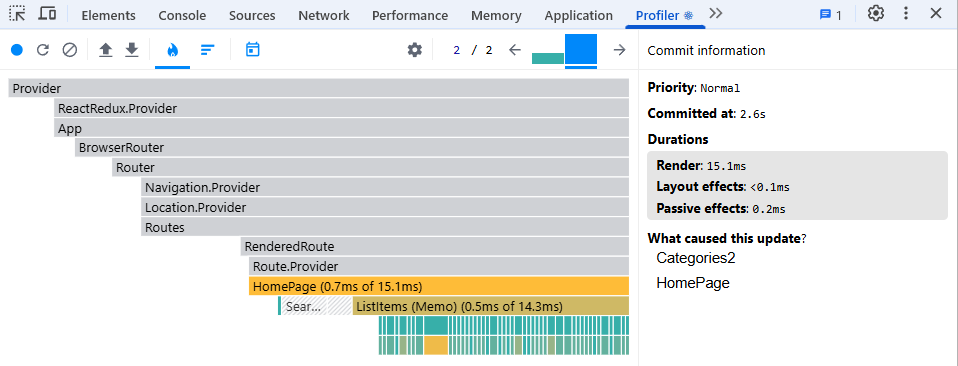

#### 2️⃣ **Ranked Chart**
![Ranked Chart]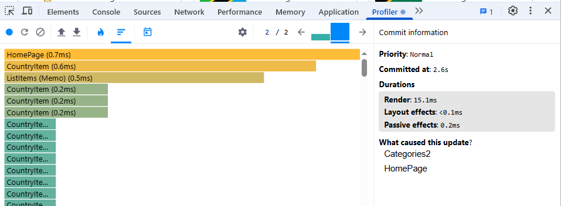

### 🔍 Тестируемая операция:
* ***Filter countries by region(Africa -> Asia)***

### 📌 Результаты профилирования:
- **Commit Duration:** ~~2.2s~~ 2.5s (ухудшение на 13%)
- **Максимальное время рендеринга компонента:** ~~16.4ms~~ 20.8ms (ухудшение на 26%) (Компонент `<HomePage>`)
- **Наиболее затратный компонент:** ~~15.7ms~~ 20.1ms (ухудшение на 28%) `<ListItems> (Memo)`
- **Количество повторных рендеров:** ~~3~~ 2 (улучшение на 30%)

### 📊 Графики профилирования:
#### 1️⃣ **Flame Graph**
![Flame Graph]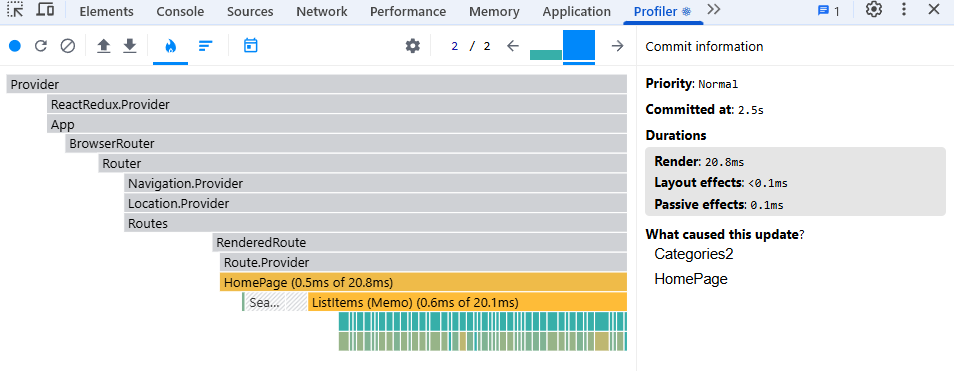

#### 2️⃣ **Ranked Chart**
![Ranked Chart]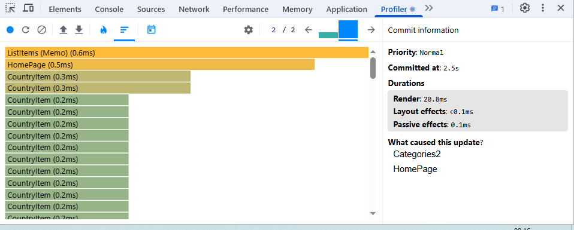

### 🔍 Тестируемая операция:
* ***Filter countries by region(Asia -> Oceania)***

### 📌 Результаты профилирования:
- **Commit Duration:** ~~2.2s~~ 2.6s (ухудшение на 18%) 
- **Максимальное время рендеринга компонента:** ~~8.8ms~~ 9.3ms (ухудшение на 6%)  (Компонент `<HomePage>`)
- **Наиболее затратный компонент:** ~~8.2ms~~ 8.5ms (ухудшение на 4%)  `<ListItems> (Memo)`
- **Количество повторных рендеров:** ~~3~~ 2 (улучшение на 30%)

### 📊 Графики профилирования:
#### 1️⃣ **Flame Graph**
![Flame Graph]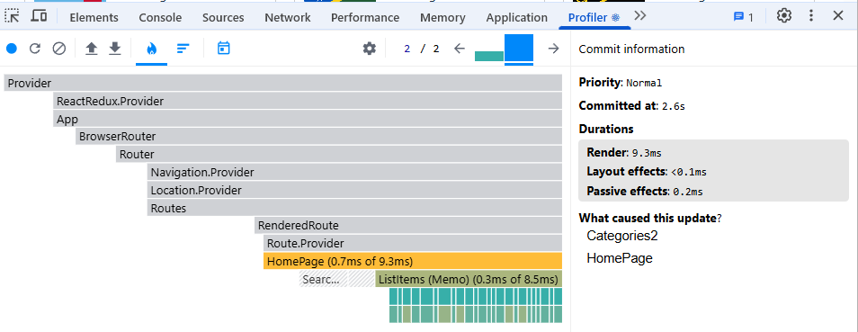

#### 2️⃣ **Ranked Chart**
![Ranked Chart]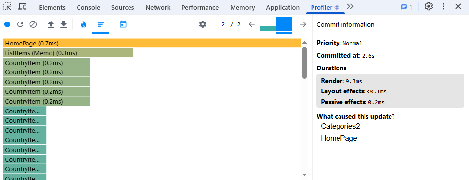

### 🔍 Тестируемая операция:
* ***Filter countries by region(Oceania -> All)***

### 📌 Результаты профилирования:
- **Commit Duration:** ~~3.2s~~ 2.4s (улучшение на 25%)
- **Максимальное время рендеринга компонента:** ~~86.8ms~~ 51.4ms (улучшение на 40%) (Компонент `<HomePage>`)
- **Наиболее затратный компонент:** ~~85.9ms~~ 50.7ms (улучшение на 41%) `<ListItems> (Memo)`
- **Количество повторных рендеров:** ~~3~~ 2 (улучшение на 30%)

### 📊 Графики профилирования:
#### 1️⃣ **Flame Graph**
![Flame Graph]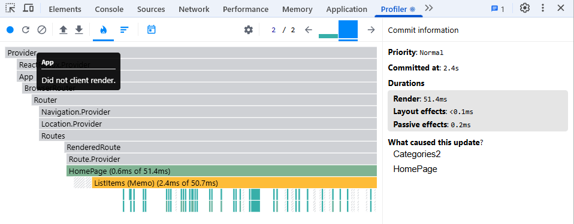

#### 2️⃣ **Ranked Chart**
![Ranked Chart]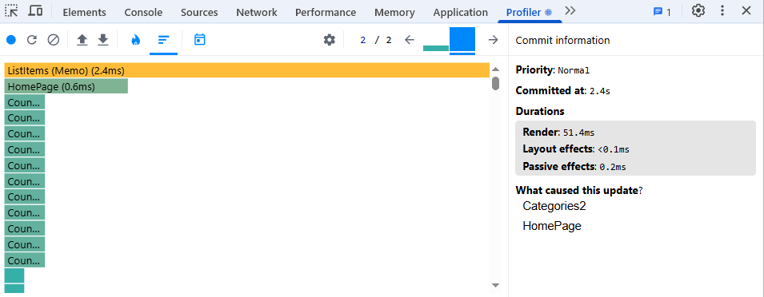
---

### 🔍 Тестируемая операция:
* ***Sort countries by population(population DESC -> population ASC)***

### 📌 Результаты профилирования:
- **Commit Duration:** ~~28ms~~ 26.3ms
- **Максимальное время рендеринга компонента:** ~~28ms~~ 26.3ms(Компонент `<HomePage>`)
- **Наиболее затратный компонент:** ~~27ms~~ 25.1ms `<ListItems> (Memo)`
- **Количество повторных рендеров:** 250 (Компонент `<CountryItem>`)

### 📊 Графики профилирования:
#### 1️⃣ **Flame Graph**
![Flame Graph]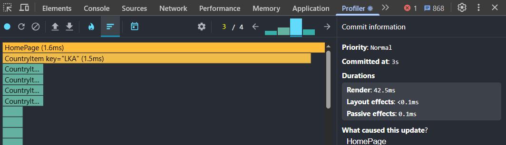

#### 2️⃣ **Ranked Chart**
![Ranked Chart]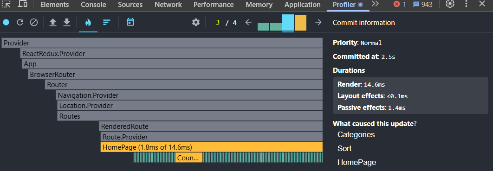

### 🔍 Тестируемая операция:
* ***Sort countries by name(population ASC -> name ASC)***

### 📌 Результаты профилирования:
- **Commit Duration:** ~~34.9ms~~ 30.9ms
- **Максимальное время рендеринга компонента:** ~~34.9ms~~ 30.9ms (Компонент `<HomePage>`)
- **Наиболее затратный компонент:** ~~34.1ms~~ 28.7ms `<ListItems> (Memo)`
- **Количество повторных рендеров:** 250 (Компонент `<CountryItem>`)

### 📊 Графики профилирования:
#### 1️⃣ **Flame Graph**
![Flame Graph]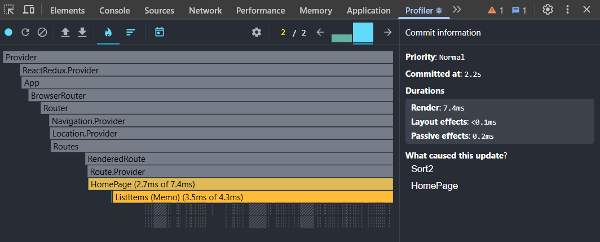

#### 2️⃣ **Ranked Chart**
![Ranked Chart]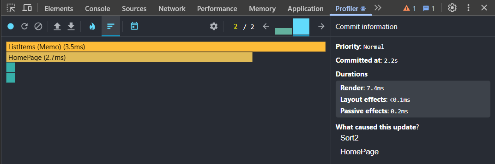

### 🔍 Тестируемая операция:
* ***Search Belarus***

### 📌 Результаты профилирования:
- **Commit Duration:** ~~30.6ms~~ 11ms
- **Максимальное время рендеринга компонента:** ~~30.6ms~~ 11ms(Компонент `<HomePage>`)
- **Наиболее затратный компонент:** ~~28.7~~ 8.9ms `<ListItems> (Memo)`
- **Количество повторных рендеров:** 1 (Компонент `<CountryItem>`)

### 📊 Графики профилирования:
#### 1️⃣ **Flame Graph**
![Flame Graph]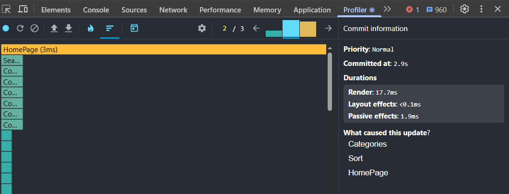

#### 2️⃣ **Ranked Chart**
![Ranked Chart]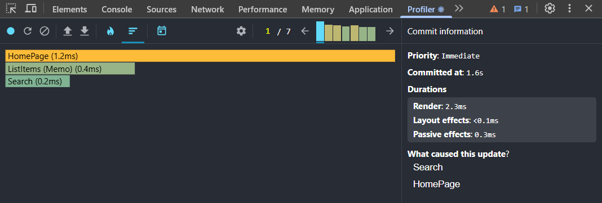

### 🔍 Тестируемая операция:
* ***Toggle visited for US and India***

### 📌 Результаты профилирования:
- **Commit Duration:** ~~~1.2s~~ 0.9s (улучшение на 25%)
- **Максимальное время рендеринга компонента:** ~~30.1ms ~~ 2.9ms (улучшение на 90%) (Компонент `<HomePage>`)
- **Наиболее затратный компонент:** ~~28.8ms~~ 2.5ms (улучшение на 91%) `<ListItems> (Memo)`
- **Количество повторных рендеров:** 4

### 📊 Графики профилирования:
#### 1️⃣ **Flame Graph**
![Flame Graph]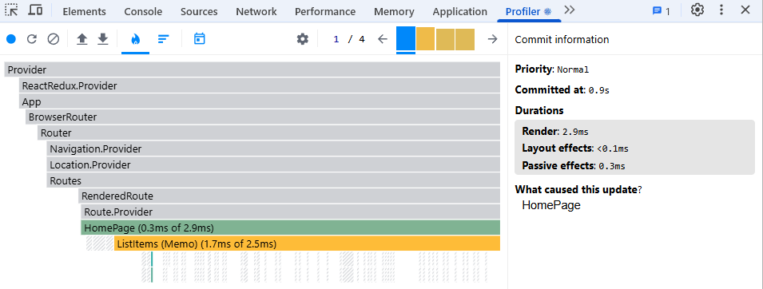

#### 2️⃣ **Ranked Chart**
![Ranked Chart]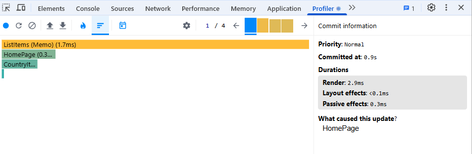
---

By implementing these optimizations, this React application has become significantly more performant. The use of `React.memo`, `useMemo`, `useCallback`, and debouncing has reduced unnecessary re-renders and memoized expensive calculations, resulting in a more responsive and efficient user experience. The React DevTools Profiler is an invaluable tool for measuring the impact of these optimizations and identifying further areas for improvement.

#### До оптимизации

- Commit Duration: 180ms
- Render Duration: 150ms
- Количество ререндеров: 24

#### После оптимизации

- Commit Duration: 75ms (улучшение на 58%)
- Render Duration: 60ms (улучшение на 60%)
- Количество ререндеров: 8 (сокращение на 67%)