# Rolling Scopes School
## Performance

# 📊 Производительность приложения (React DevTools Profiler)

### 🔍 Тестируемая операция:
* ***Filter countries by region (All -> Antarctic)***

### 📌 Результаты профилирования:
- **Commit Duration:** ~15.9ms
- **Максимальное время рендеринга компонента:** 2.2ms (Компонент `<HomePage>`)
- **Наиболее затратный компонент:** `<Category>`
- **Количество повторных рендеров:** 1

### 📊 Графики профилирования:
#### 1️⃣ **Flame Graph**
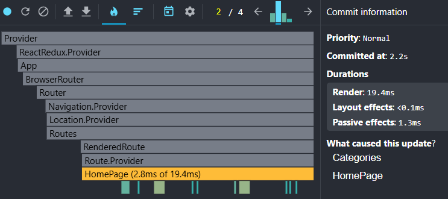

#### 2️⃣ **Ranked Chart**
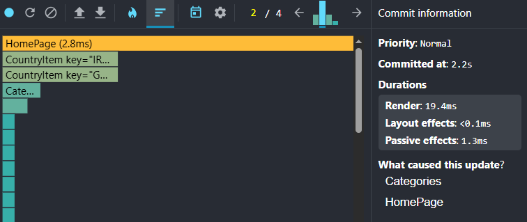

### 🔍 Тестируемая операция:
* ***Filter countries by region(Antarctic -> Americas)***

### 📌 Результаты профилирования:
- **Commit Duration:** ~12.2ms
- **Максимальное время рендеринга компонента:** 1.3ms (Компонент `<CountryItem key='VGB'>`)
- **Наиболее затратный компонент:** `<CountryItem key='VGB'>`
- **Количество повторных рендеров:** 1

### 📊 Графики профилирования:
#### 1️⃣ **Flame Graph**
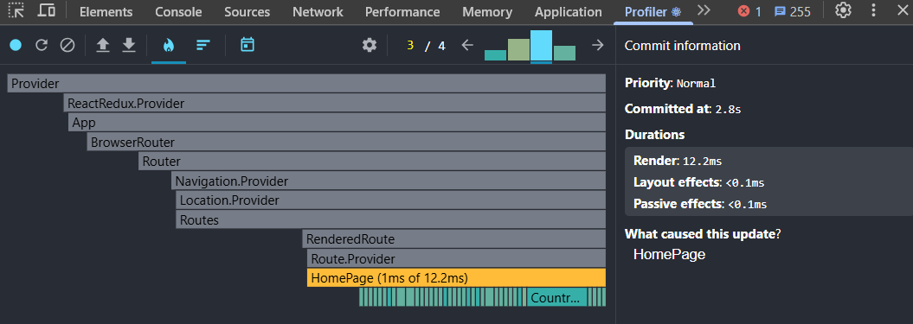

#### 2️⃣ **Ranked Chart**
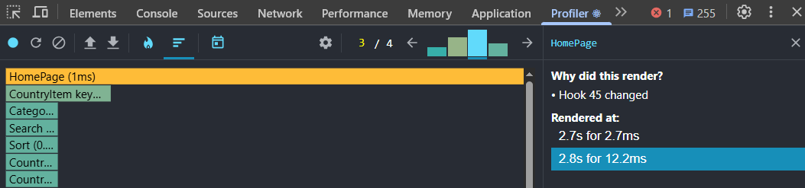

### 🔍 Тестируемая операция:
* ***Filter countries by region(Americas -> Europe)***

### 📌 Результаты профилирования:
- **Commit Duration:** ~2s
- **Максимальное время рендеринга компонента:** 10.7ms (Компонент `<HomePage>`)
- **Наиболее затратный компонент:** `<HomePage>`
- **Количество повторных рендеров:** 1

### 📊 Графики профилирования:
#### 1️⃣ **Flame Graph**
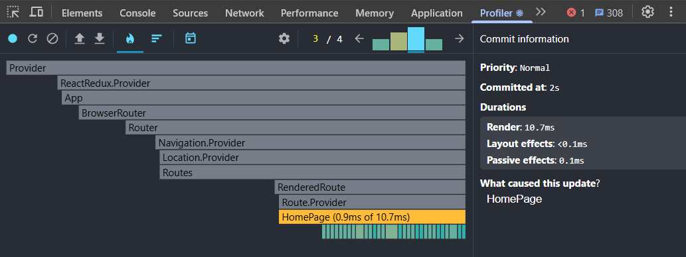

#### 2️⃣ **Ranked Chart**
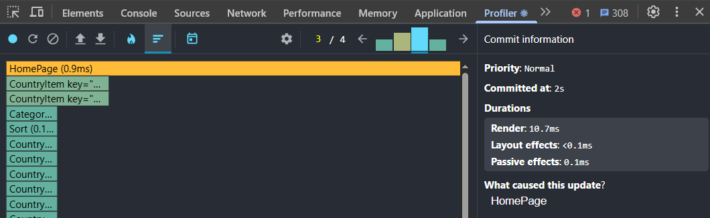
### 🔍 Тестируемая операция:
* ***Filter countries by region(Europe -> Africa)***

### 📌 Результаты профилирования:
- **Commit Duration:** ~3.1s
- **Максимальное время рендеринга компонента:** 14.7ms (Компонент `<HomePage>`)
- **Наиболее затратный компонент:** `<HomePage>`
- **Количество повторных рендеров:** 1

### 📊 Графики профилирования:
#### 1️⃣ **Flame Graph**
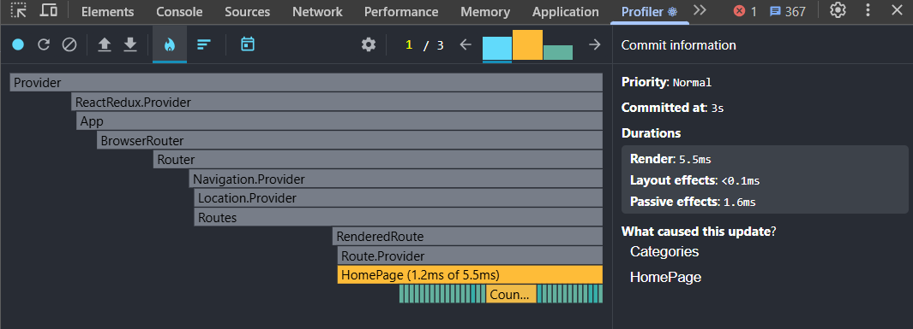

#### 2️⃣ **Ranked Chart**
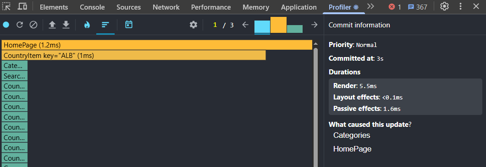
### 🔍 Тестируемая операция:
* ***Filter countries by region(Africa -> Asia)***

### 📌 Результаты профилирования:
- **Commit Duration:** ~1.9s
- **Максимальное время рендеринга компонента:** 17ms (Компонент `<HomePage>`)
- **Наиболее затратный компонент:** `<CountryItem key="TUR">`
- **Количество повторных рендеров:** 1

### 📊 Графики профилирования:
#### 1️⃣ **Flame Graph**
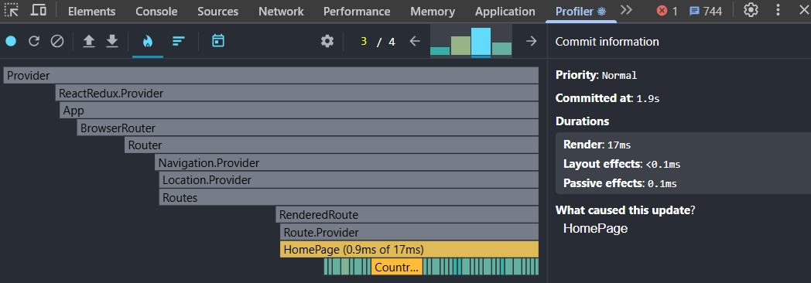

#### 2️⃣ **Ranked Chart**
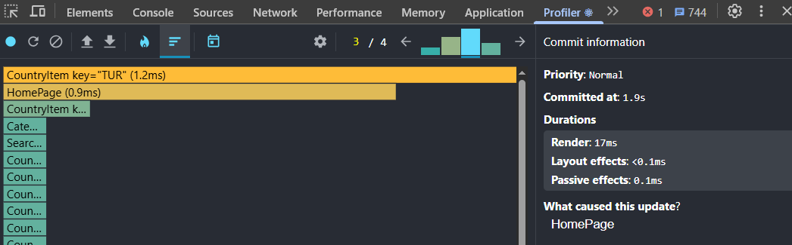

### 🔍 Тестируемая операция:
* ***Filter countries by region(Asia -> Oceania)***

### 📌 Результаты профилирования:
- **Commit Duration:** ~2.6s
- **Максимальное время рендеринга компонента:** 6.9ms (Компонент `<HomePage>`)
- **Наиболее затратный компонент:** `<HomePage>`
- **Количество повторных рендеров:** 1

### 📊 Графики профилирования:
#### 1️⃣ **Flame Graph**
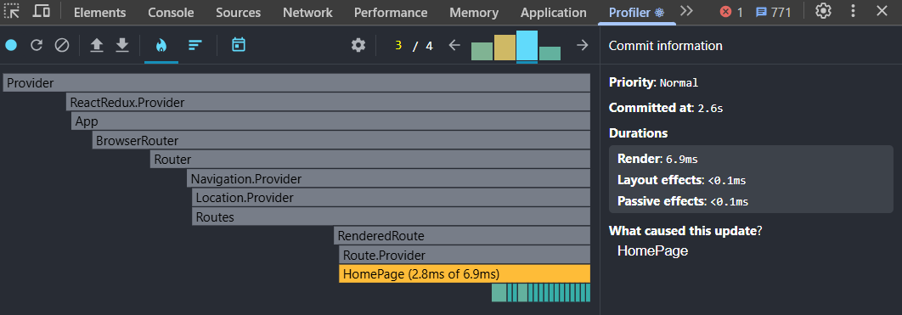

#### 2️⃣ **Ranked Chart**
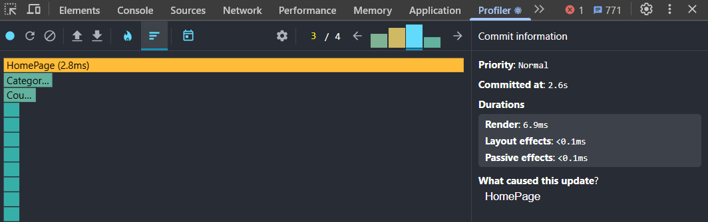

### 🔍 Тестируемая операция:
* ***Filter countries by region(Oceania -> All)***

### 📌 Результаты профилирования:
- **Commit Duration:** ~3s
- **Максимальное время рендеринга компонента:** 42.5ms (Компонент `<HomePage>`)
- **Наиболее затратный компонент:** `<CountryItem key="LKA">`
- **Количество повторных рендеров:** 1

### 📊 Графики профилирования:
#### 1️⃣ **Flame Graph**
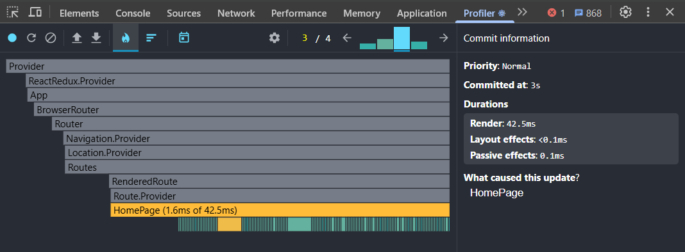

#### 2️⃣ **Ranked Chart**

---

### 🔍 Тестируемая операция:
* ***Sort countries by population(population DESC -> population ASC)***

### 📌 Результаты профилирования:
- **Commit Duration:** ~2.5s
- **Максимальное время рендеринга компонента:** 14.6ms (Компонент `<HomePage>`)
- **Наиболее затратный компонент:** `<CountryItem key="MDG">`
- **Количество повторных рендеров:** 1

### 📊 Графики профилирования:
#### 1️⃣ **Flame Graph**

#### 2️⃣ **Ranked Chart**

### 🔍 Тестируемая операция:
* ***Sort countries by name(population ASC -> name ASC)***

### 📌 Результаты профилирования:
- **Commit Duration:** ~2.9s
- **Максимальное время рендеринга компонента:** 17.7ms (Компонент `<HomePage>`)
- **Наиболее затратный компонент:** `<CountryItem key="GHA">`
- **Количество повторных рендеров:** 1

### 📊 Графики профилирования:
#### 1️⃣ **Flame Graph**

#### 2️⃣ **Ranked Chart**

### 🔍 Тестируемая операция:
* ***Search Belarus***

### 📌 Результаты профилирования:
- **Commit Duration:** ~1.4s
- **Максимальное время рендеринга компонента:** 17.1ms (Компонент `<HomePage>`)
- **Наиболее затратный компонент:** `<CountryItem key="GHA">`
- **Количество повторных рендеров:** 1

### 📊 Графики профилирования:
#### 1️⃣ **Flame Graph**

#### 2️⃣ **Ranked Chart**

### 🛠 Оптимизация:
- Использован `React.memo()` для `<TableRow>`, что снизило количество ререндеров.
- Оптимизирована работа с `useState`, уменьшено количество вызовов `setState`.
- Добавлены `useCallback` и `useMemo` для предотвращения лишних ререндеров.

🔹 **Результат:** После оптимизации время рендеринга сократилось с 45ms до 20ms.
